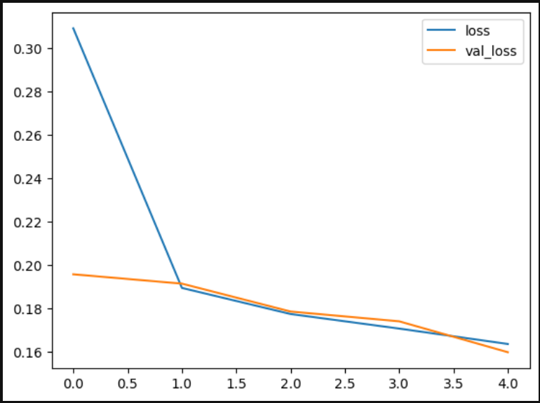
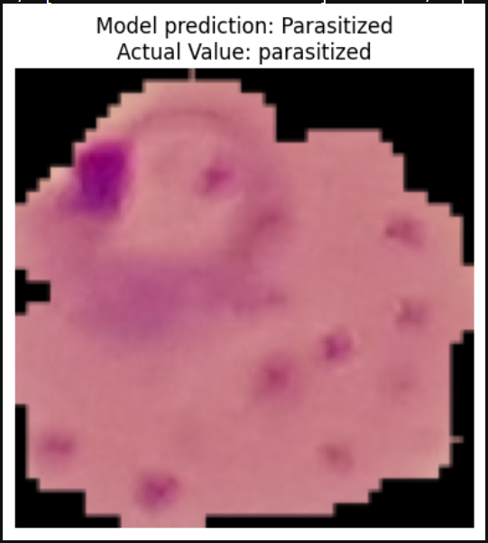

# Deep Neural Network for Malaria Infected Cell Recognition

## AIM

To develop a deep neural network for Malaria infected cell recognition and to analyze the performance.

## Problem Statement and Dataset
Malaria dataset of 27,558 cell images with an equal number of parasitized and uninfected cells. A level-set based algorithm was applied to detect and segment the red blood cells. The images were collected and annotated by medical professionals.Here we build a convolutional neural network model that is able to classify the cells. 
## Neural Network Model


## DESIGN STEPS

### STEP 1:
Import tensorflow and preprocessing libraries.

### STEP 2:
Download and load the dataset folder.
### STEP 3:
Split the training and testing folders.
### Step 4:
Perform image data generation methods.
### Step 5:
Build the convolutional neural network model.
### Step 6:
Train the model with the training data.
### Step 7:
Plot the performance plot.
### Step 8:
Evaluate the model with the testing data using probability prediction(uninfected-> prob>0.5,parasitized-> <=0.5).
### Step 9:
Fit the model and predict the sample input.

## PROGRAM
```
Developed By: POOJITHASETTY

Register No.: 212221240050
```
###  Import Liraries
```
import os
import random as rnd

import pandas as pd
import numpy as np
import seaborn as sns
import matplotlib.pyplot as plt
from matplotlib.image import imread
from sklearn.metrics import classification_report,confusion_matrix

import tensorflow as tf
from tensorflow.keras import layers
from tensorflow.keras import utils
from tensorflow.keras import models
from tensorflow.keras.preprocessing.image import ImageDataGenerator
from tensorflow.compat.v1.keras.backend import set_session
```
### Allow GPU Processing
```
config = tf.compat.v1.ConfigProto()
config.gpu_options.allow_growth = True # dynamically grow the memory used on the GPU
config.log_device_placement = True # to log device placement 
sess = tf.compat.v1.Session(config=config)
set_session(sess)
```
### Read Images
```
my_data_dir = "./cell_images"

os.listdir(my_data_dir)

test_path = my_data_dir+'/test/'
train_path = my_data_dir+'/train/'

os.listdir(train_path)

len(os.listdir(train_path+'/uninfected/'))

len(os.listdir(train_path+'/parasitized/'))

os.listdir(train_path+'/parasitized')[0]

para_img= imread(train_path+'/parasitized/'+os.listdir(train_path+'/parasitized')[0])

plt.imshow(para_img)
```
### Checking the image dimensions
```
dim1 = []
dim2 = []

for image_filename in os.listdir(test_path+'/uninfected'):
    img = imread(test_path+'/uninfected'+'/'+image_filename)
    d1,d2,colors = img.shape
    dim1.append(d1)
    dim2.append(d2)

sns.jointplot(x=dim1,y=dim2)

image_shape = (130,130,3)
```
### Image Generator
```
image_gen=ImageDataGenerator(rotation_range=20,width_shift_range=0.10,
				height_shift_range=0.10,rescale=1/255,shear_range=0.1,zoom_range=0.1,
				horizontal_flip=True, fill_mode='nearest')
image_gen.flow_from_directory(train_path)
image_gen.flow_from_directory(test_path)
```
### DL Model - Build & Compile
```
model = models.Sequential()
model.add(keras.Input(shape=(image_shape)))
model.add(layers.Conv2D(filters=32,kernel_size=(3,3),activation='relu',))
model.add(layers.MaxPooling2D(pool_size=(2, 2)))

model.add(layers.Conv2D(filters=64, kernel_size=(3,3), activation='relu',))
model.add(layers.MaxPooling2D(pool_size=(2, 2)))

model.add(layers.Conv2D(filters=64, kernel_size=(3,3), activation='relu',))
model.add(layers.MaxPooling2D(pool_size=(2, 2)))

model.add(layers.Flatten())

model.add(layers.Dense(128))
model.add(layers.Dense(64,ativation='relu'))
model.add(layers.Dropout(0.5))
model.add(layers.Dense(1,activation='sigmoid'))
model.compile(loss='binary_crossentropy',optimizer='adam',metrics=['accuracy'])
model.summary()

batch_size = 16
```
### Fit the model
```
train_image_gen = image_gen.flow_from_directory(train_path,target_size=image_shape[:2],
                              color_mode='rgb',batch_size=batch_size,class_mode='binary')
train_image_gen.batch_size
len(train_image_gen.classes)
train_image_gen.total_batches_seen
test_image_gen = image_gen.flow_from_directory(test_path,target_size=image_shape[:2],
                              color_mode='rgb',batch_size=batch_size,
                              class_mode='binary',shuffle=False)
train_image_gen.class_indices
results = model.fit(train_image_gen,epochs=2,validation_data=test_image_gen)
model.save('cell_model.h5')
```
### Plot the graphs
```
losses = pd.DataFrame(model.history.history)
losses[['loss','val_loss']].plot()
model.metrics_names
```
### Evaluate Metrics
```
model.evaluate(test_image_gen)
pred_probabilities = model.predict(test_image_gen)
test_image_gen.classes
predictions = pred_probabilities > 0.5
print(classification_report(test_image_gen.classes,predictions))
confusion_matrix(test_image_gen.classes,predictions)
```
### Check for New Image
```
list_dir=["Un Infected","parasitized"]
dir_=(rnd.choice(list_dir))
p_img=imread(train_path+'/'+dir_+'/'+os.listdir(train_path+'/'+dir_)[rnd.randint(0,100)])
img  = tf.convert_to_tensor(np.asarray(p_img))
img = tf.image.resize(img,(130,130))
img=img.numpy()
pred=bool(model.predict(img.reshape(1,130,130,3))<0.5 )
plt.title("Model prediction: "+("Parasitized" if pred  else "Un Infected")
			+"\nActual Value: "+str(dir_))
plt.axis("off")
plt.imshow(img)
plt.show()
```


## OUTPUT

### Training Loss, Validation Loss Vs Iteration Plot



### Classification Report


### Confusion Matrix


### New Sample Data Prediction


## RESULT:
Thus, a deep neural network for Malaria infected cell recognition is developed and the performance is analyzed.
